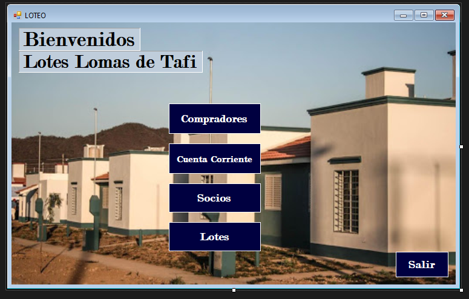
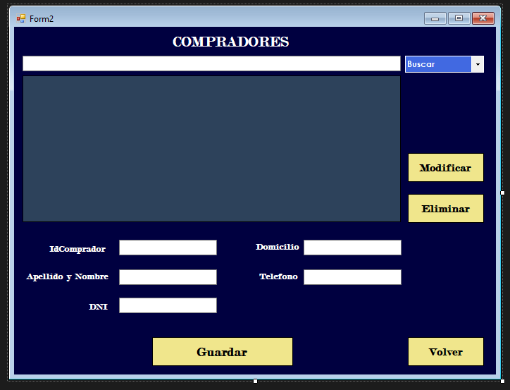
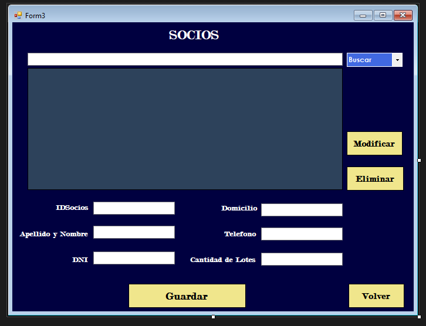

<h1 align="center" id="title">Proyecto de Loteo</h1>

Una aplicacion de Windows Forms realizada para llevar a cabo la completa documentacion de cada comprador socio cuenta corriente y lotes ingresados en la base de datos SqlServer.

<h2>Capturas de pantalla:</h2>

  
  
<h2>🧐 Caracteristicas</h2>

Aplicacion agradable para el uso del usuario.

Facil de usar, versatil.  
  
<h2>💻 Construido con</h2>

Tecnologias utilizadas en el proyecto:

*   C# C-sharp
*   SqlServer
